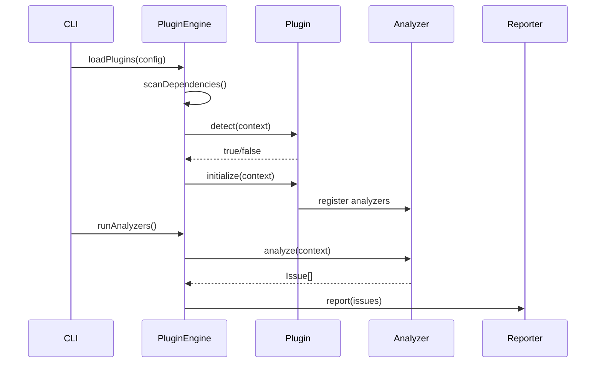
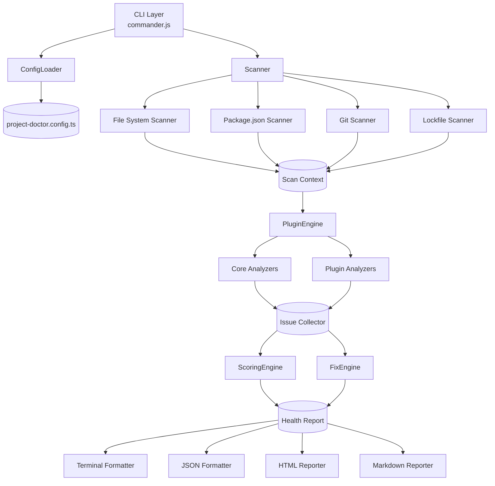
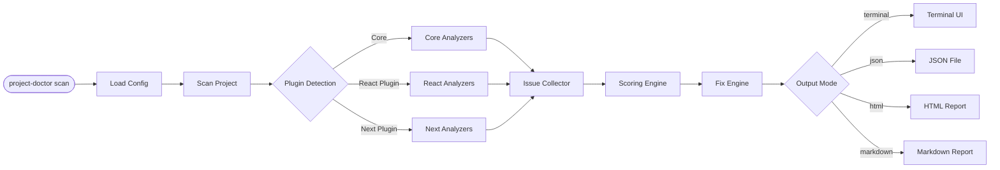
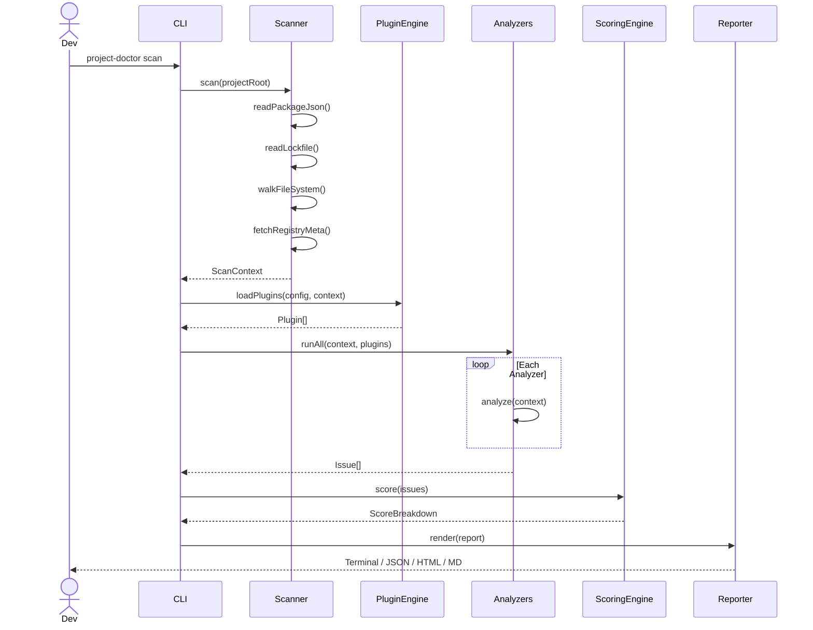
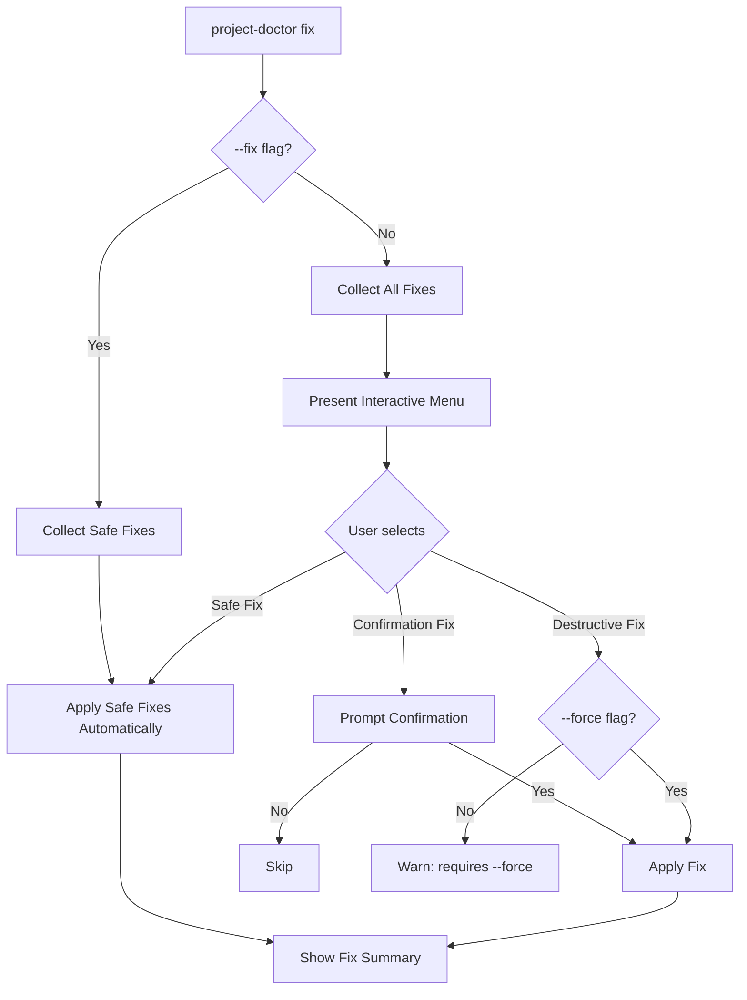

# Project Doctor — Architecture & Planning Document

> **Version:** 1.0 | **Status:** Living Document | **Last Updated:** June 2026
>
> *"Lighthouse for JavaScript projects — scan, score, fix, repeat."*

---

## Table of Contents

1. [Vision](#1-vision)
2. [Product Goals](#2-product-goals)
3. [Competitive Analysis](#3-competitive-analysis)
4. [Features](#4-features)
5. [Plugin System](#5-plugin-system)
6. [Architecture](#6-architecture)
7. [Folder Structure](#7-folder-structure)
8. [Scoring System](#8-scoring-system)
9. [Auto Fix Engine](#9-auto-fix-engine)
10. [CLI Design](#10-cli-design)
11. [Output Design](#11-output-design)
12. [Configuration](#12-configuration)
13. [API Design](#13-api-design)
14. [Development Roadmap](#14-development-roadmap)
15. [Testing Strategy](#15-testing-strategy)
16. [CI/CD](#16-cicd)
17. [Future Ideas](#17-future-ideas)

---

# 1. Vision

## Problem Statement

JavaScript and TypeScript projects accumulate technical debt invisibly. A developer bootstraps a project, ships features rapidly, and six months later the codebase is riddled with unused dependencies, missing documentation, absent test coverage, stale CI pipelines, and zero security hygiene — yet there is no single tool that surfaces all of this in one place with clear, prioritized, actionable guidance.

Today, a developer who wants to assess their project's health must run:

- `npm audit` for security
- `depcheck` or `knip` for unused dependencies
- `npm outdated` for stale packages
- Manual inspection for README/LICENSE/CHANGELOG
- Separate configuration for ESLint, Prettier, and TypeScript strictness
- Manual CI/CD setup review
- Bundle analysis tools separately

The result is either no health checks at all, or fragmented reports with no unified score, no cross-concern correlation, and no automatic remediation path.

## Why Existing Tools Are Insufficient

| Problem | No single score | Siloed concerns | No auto-fix | No plugin API | No HTML/Markdown report |
|---------|-----------------|-----------------|-------------|----------------|------------------------|
| npm audit | ✅ | ✅ | ❌ | ❌ | ❌ |
| depcheck | ✅ | ✅ | ❌ | ❌ | ❌ |
| ESLint | ✅ | ✅ | partial | ✅ | ❌ |
| TypeScript | ✅ | ✅ | ❌ | ❌ | ❌ |
| Knip | ✅ | ✅ | partial | ❌ | ❌ |

None of these tools answer the developer's most fundamental question: **"Is my project healthy?"**

## Target Audience

**Primary**
- Open-source maintainers who want to keep their libraries production-grade
- Solo developers preparing projects for team handover or public release
- Tech leads auditing team repositories before a major release

**Secondary**
- DevOps/Platform engineers enforcing organization-wide project standards
- Agencies delivering client projects who need a final quality gate
- OSS contributors evaluating a project before investing time

**Tertiary**
- CI/CD pipelines requiring an automated quality gate
- GitHub App users who want per-PR health scoring

## Long-Term Vision

Project Doctor becomes the **standard health layer for the JavaScript ecosystem** — an opinionated, extensible, beautiful CLI that every serious JavaScript project runs before ship. Over time it evolves into:

- A GitHub App that comments health scores on every PR
- A VS Code extension that shows inline health warnings
- A web dashboard with historical trend analytics
- An AI-powered advisor that explains *why* things matter and *how* to fix them

Think of it as Lighthouse for runtime performance, but for **project architecture, maintainability, and operational readiness**.

## Success Metrics

| Metric | 6 Months | 12 Months | 24 Months |
|--------|----------|-----------|-----------|
| npm weekly downloads | 10,000 | 100,000 | 500,000 |
| GitHub stars | 500 | 5,000 | 25,000 |
| Community plugins | 5 | 25 | 100 |
| Sponsors / funding | $0 | $1,000/mo | $10,000/mo |
| Press / articles | 2 | 20 | 100 |
| CI adoption (known orgs) | 10 | 100 | 1,000 |

---

# 2. Product Goals

## MVP — Version 1.0

**Scope:** A stable, well-tested CLI that delivers immediate value to any JS/TS project with zero configuration.

**Included:**
- Core scanner (file system, `package.json`, lockfile)
- Dependency analysis (unused, outdated, deprecated)
- Security audit (npm audit integration)
- Documentation checks (README, LICENSE, CHANGELOG presence & quality)
- Code quality checks (ESLint config detection, Prettier, TypeScript strict mode)
- Basic CI/CD detection (GitHub Actions, GitLab CI)
- 100-point weighted scoring engine
- Terminal output (color, tables, summary)
- JSON output for CI pipelines
- `project-doctor fix` with safe automatic fixes
- `project-doctor init` to scaffold a configuration file

**Success criteria:** A developer can run `npx project-doctor` in any JS/TS project and get a useful health report in under 10 seconds.

---

## Version 2.0

**Scope:** Plugin ecosystem, richer output, team workflows.

**Included:**
- Plugin system (react, next, vite, express, nestjs)
- HTML report with interactive dashboard
- Markdown report (for GitHub CI comments)
- Monorepo support (Turborepo, Nx, pnpm workspaces)
- Per-package scoring in monorepos
- `project-doctor watch` mode for continuous feedback
- Framework-specific checks via plugins
- Severity filtering (`--only errors`, `--min-score 70`)
- Ignore file / inline suppression comments
- GitHub Actions output formatter

---

## Version 3.0

**Scope:** Intelligence, integrations, and ecosystem dominance.

**Included:**
- AI-powered recommendations (Claude / GPT integration)
- GitHub App (PR comments, status checks)
- VS Code extension
- Web dashboard (historical trends, team views)
- REST API for external integrations
- Custom rule authoring (like ESLint custom rules)
- `project-doctor compare` (diff health between branches or dates)
- Pull Request health scoring
- Bundle analysis plugin
- Performance budgets

---

## Future Roadmap (Beyond V3)

- Proprietary SaaS dashboard with team analytics
- Enterprise on-premise deployment
- Certified "Project Doctor Approved" badge program
- Integration with Dependabot, Renovate, and Snyk
- Multi-language support (Python, Go, Rust project health)
- IDE integrations (JetBrains, Neovim LSP)

---

# 3. Competitive Analysis

## Tool-by-Tool Breakdown

### npm audit
**What it does well:** Deep integration with the npm registry; surfaces CVE data and severity ratings for dependency vulnerabilities. The gold standard for security scanning.

**Gaps:** Covers only security. No scoring, no documentation checks, no quality metrics, no fix suggestions beyond `npm audit fix`. Output is dense and hard to act on.

---

### npm doctor
**What it does well:** Validates that the npm toolchain itself is healthy (node version, npm version, registry connectivity, git, permissions).

**Gaps:** Checks the *tool*, not the *project*. Completely orthogonal to Project Doctor's mission.

---

### Knip
**What it does well:** Exceptionally thorough dead code detection — unused exports, types, files, and dependencies. Best-in-class for this specific problem.

**Gaps:** Siloed to unused code. No scoring, no security, no docs, no CI/CD analysis. No fix engine beyond listing issues.

---

### depcheck
**What it does well:** Fast detection of unused and missing dependencies by analyzing `import`/`require` statements.

**Gaps:** Older tool with limited TypeScript awareness. No scoring, no broader project health concerns.

---

### ESLint
**What it does well:** Highly configurable static analysis for JavaScript and TypeScript. Rich plugin ecosystem. Auto-fix for many rule violations.

**Gaps:** Requires significant configuration to be useful. Does not assess project health at the macro level — no dependency analysis, no docs checks, no CI/CD integration.

---

### TypeScript
**What it does well:** Best-in-class static type checking for JavaScript. Catches entire classes of bugs at compile time.

**Gaps:** Strictly a type checker. No project health concerns. Does not analyze dependencies, docs, CI, or security.

---

### Lighthouse
**What it does well:** The closest conceptual analog. Produces a 0–100 score across multiple categories (Performance, Accessibility, SEO, Best Practices, PWA). Beautiful HTML reports. Actionable recommendations with documentation links.

**Gaps:** Analyzes *web page runtime performance*, not project source health. Cannot be applied to a Node.js library, CLI, or non-browser project.

---

## Feature Matrix

| Feature | npm audit | depcheck | Knip | ESLint | TypeScript | Lighthouse | **Project Doctor** |
|---|:---:|:---:|:---:|:---:|:---:|:---:|:---:|
| Security scanning | ✅ | ❌ | ❌ | ❌ | ❌ | partial | ✅ |
| Dependency analysis | partial | ✅ | ✅ | ❌ | ❌ | ❌ | ✅ |
| Code quality | ❌ | ❌ | partial | ✅ | ✅ | ❌ | ✅ |
| Documentation checks | ❌ | ❌ | ❌ | ❌ | ❌ | ❌ | ✅ |
| CI/CD analysis | ❌ | ❌ | ❌ | ❌ | ❌ | ❌ | ✅ |
| Testing analysis | ❌ | ❌ | ❌ | ❌ | ❌ | ❌ | ✅ |
| Performance analysis | ❌ | ❌ | ❌ | ❌ | ❌ | ✅ | ✅ |
| Unified score | ❌ | ❌ | ❌ | ❌ | ❌ | ✅ | ✅ |
| Auto-fix engine | partial | ❌ | ❌ | partial | ❌ | ❌ | ✅ |
| Plugin API | ❌ | ❌ | ❌ | ✅ | ❌ | ❌ | ✅ |
| HTML report | ❌ | ❌ | ❌ | ❌ | ❌ | ✅ | ✅ |
| Markdown report | ❌ | ❌ | ❌ | ❌ | ❌ | ❌ | ✅ |
| JSON output | ✅ | ✅ | ✅ | ✅ | ✅ | ✅ | ✅ |
| Zero config | ✅ | ✅ | partial | ❌ | ❌ | ✅ | ✅ |
| Plugin ecosystem | ❌ | ❌ | ❌ | ✅ | ❌ | ❌ | ✅ |

---

# 4. Features

## 4.1 Dependency Analysis

| Check | Severity | Description |
|-------|----------|-------------|
| Unused dependencies | Warning | Dependencies in `package.json` not imported anywhere in source |
| Unused devDependencies | Info | Dev deps not referenced in scripts, config files, or source |
| Missing dependencies | Error | Imports found with no corresponding `package.json` entry |
| Duplicate dependencies | Warning | Same package appearing under multiple names or major versions |
| Outdated dependencies | Info/Warning | Packages with newer minor/major versions available |
| Deprecated packages | Warning | Packages marked deprecated on the npm registry |
| Pinned vs range versions | Info | Audit of `^`, `~`, and exact version pinning strategies |
| Lockfile missing | Error | No `package-lock.json`, `yarn.lock`, or `pnpm-lock.yaml` |
| Lockfile out of sync | Warning | Lockfile does not match `package.json` |
| Peer dependency violations | Error | Peer deps not satisfied by installed packages |
| Bundle size estimation | Info | Estimated contribution of each dep to bundle size |
| License compliance | Warning | Dependencies with licenses incompatible with project license |
| Nested duplicate packages | Warning | Same package installed at multiple versions in `node_modules` |

---

## 4.2 Security

| Check | Severity | Description |
|-------|----------|-------------|
| npm audit vulnerabilities | Critical/High/Medium/Low | Full CVE scan via npm registry |
| Risky package detection | High | Known malicious or typosquatted packages |
| Insecure scripts | High | `postinstall` scripts with network access or shell execution |
| `.env` committed | Critical | `.env` file tracked in git (not in `.gitignore`) |
| Secrets in source | Critical | Hard-coded API keys, tokens, or passwords detected in source |
| No `.npmignore` / `files` field | Warning | Private files may be published to npm |
| Overly broad npm publish | Warning | `files` field not set and dangerous directories may publish |
| Supply chain: maintainer count | Info | Packages with a single maintainer flagged for bus-factor risk |

---

## 4.3 Documentation

| Check | Severity | Description |
|-------|----------|-------------|
| README missing | Error | No `README.md` or `README` file detected |
| README too short | Warning | README under 200 words — likely a stub |
| README missing sections | Warning | No Installation, Usage, or API section detected |
| LICENSE missing | Error | No `LICENSE` or `LICENSE.md` file |
| LICENSE field in package.json | Warning | `license` field absent or set to `UNLICENSED` |
| CHANGELOG missing | Info | No `CHANGELOG.md` or `CHANGELOG` detected |
| CHANGELOG not updated | Warning | CHANGELOG last entry is older than 90 days (for active repos) |
| CONTRIBUTING missing | Info | No `CONTRIBUTING.md` |
| Code of Conduct missing | Info | No `CODE_OF_CONDUCT.md` |
| API documentation | Info | No JSDoc, TSDoc, or typedoc configuration found |

---

## 4.4 Code Quality

| Check | Severity | Description |
|-------|----------|-------------|
| ESLint not configured | Warning | No `.eslintrc`, `eslint.config.js`, or ESLint key in `package.json` |
| ESLint outdated | Info | ESLint major version behind current |
| Prettier not configured | Info | No `.prettierrc` or Prettier config detected |
| TypeScript not used | Info | Project is JavaScript-only (for non-trivial codebases) |
| TypeScript strict mode off | Warning | `strict: false` or missing from `tsconfig.json` |
| TypeScript `noUncheckedIndexedAccess` off | Info | Advanced safety flag not enabled |
| `tsconfig.json` missing | Warning | TypeScript project has no `tsconfig.json` |
| Inconsistent quote style | Info | Mixed single/double quotes without Prettier enforcing |
| Trailing console.log | Warning | `console.log` statements in production source |
| Skipped/disabled lint rules | Info | Excessive `eslint-disable` comments |
| No `.editorconfig` | Info | Missing cross-editor consistency config |

---

## 4.5 Testing

| Check | Severity | Description |
|-------|----------|-------------|
| No test framework | Error | No Jest, Vitest, Mocha, tap, or similar detected |
| No test files | Error | Test framework present but no test files found |
| No test script | Warning | No `test` script in `package.json` |
| Coverage not configured | Warning | No coverage reporting configured |
| Coverage below threshold | Warning | Line/branch coverage below configured minimum (default 80%) |
| No coverage badge | Info | README contains no coverage badge |
| Tests never run in CI | Warning | No CI pipeline step runs tests |
| Snapshot tests stale | Info | Jest/Vitest snapshots older than 90 days |

---

## 4.6 CI/CD

| Check | Severity | Description |
|-------|----------|-------------|
| No CI/CD pipeline | Warning | No GitHub Actions, GitLab CI, CircleCI, etc. detected |
| CI pipeline not running tests | Warning | CI present but no test step found |
| CI pipeline not running lint | Info | CI present but no lint step found |
| CI pipeline not running type-check | Info | TypeScript project CI missing `tsc --noEmit` |
| No release automation | Info | No semantic-release, changesets, or release-please configured |
| No dependabot / Renovate | Info | No automated dependency update bot configured |
| Pinned GitHub Actions versions | Warning | Actions not pinned to SHA (supply chain risk) |
| Workflow secrets exposed | Critical | Hardcoded secrets in workflow YAML files |

---

## 4.7 Repository

| Check | Severity | Description |
|-------|----------|-------------|
| Branch protection not recommended | Warning | No evidence of branch protection rules (inferred from workflow) |
| No CODEOWNERS | Info | No `CODEOWNERS` file in root, `.github/`, or `docs/` |
| No issue templates | Info | No `.github/ISSUE_TEMPLATE/` directory |
| No PR template | Info | No `.github/pull_request_template.md` |
| `.github` directory missing | Info | Standard community health files not organized under `.github/` |
| No bug report template | Info | Missing structured bug report template |
| No feature request template | Info | Missing structured feature request template |
| Large binary files in git | Warning | Binary files over 500KB tracked in git (should use Git LFS) |

---

## 4.8 Performance

| Check | Severity | Description |
|-------|----------|-------------|
| Bundle size estimation | Info | Estimated minified+gzipped bundle size |
| No tree-shaking support | Warning | Package has no `module` / `exports` field (no ESM entry) |
| Large individual dependencies | Warning | Any single dependency estimated over 100KB gzipped |
| No sideEffects field | Warning | `sideEffects` field absent (library cannot be tree-shaken) |
| Unoptimized images | Warning | Image files in repo over 500KB |
| Missing compression | Info | HTTP server detected but no compression middleware configured |

---

## 4.9 Best Practices

| Check | Severity | Description |
|-------|----------|-------------|
| No `.gitignore` | Error | `.gitignore` missing |
| Minimal `.gitignore` | Warning | `node_modules` not in `.gitignore` |
| `node_modules` committed | Critical | `node_modules` tracked in git |
| Missing `engines` field | Info | `engines` field not specified in `package.json` |
| Missing `main`/`exports` field | Warning | Library has no `main` or `exports` field |
| No `repository` field | Info | `repository` field missing from `package.json` |
| No `keywords` field | Info | No npm search keywords |
| No `description` field | Warning | Package description absent |
| `private: true` for libraries | Warning | Library package marked `private: true` |
| Environment variables undocumented | Warning | `.env.example` missing but `.env` pattern detected in source |
| No Husky / lint-staged | Info | No pre-commit hooks configured |

---

# 5. Plugin System

## Overview

The plugin system is the core extensibility mechanism of Project Doctor. It allows third-party developers to add framework-specific checks, custom reporters, and new fix actions without modifying core.

Plugins are standard npm packages prefixed `project-doctor-plugin-*` or scoped as `@scope/project-doctor-plugin-*`.

## First-Party Plugins

```
plugins/
├── react/           @project-doctor/plugin-react
├── next/            @project-doctor/plugin-next
├── vite/            @project-doctor/plugin-vite
├── express/         @project-doctor/plugin-express
├── nestjs/          @project-doctor/plugin-nestjs
├── vue/             @project-doctor/plugin-vue
├── angular/         @project-doctor/plugin-angular
├── remix/           @project-doctor/plugin-remix
├── astro/           @project-doctor/plugin-astro
└── electron/        @project-doctor/plugin-electron
```

## Plugin Auto-Detection

Project Doctor automatically detects which plugins are relevant by inspecting `package.json` dependencies and applies appropriate plugins without configuration:

```
Detected react in dependencies → auto-loads @project-doctor/plugin-react
Detected next in dependencies  → auto-loads @project-doctor/plugin-next
```

Users can disable auto-detection via config.

## Plugin Architecture

A plugin is a standard ES module that exports a `ProjectDoctorPlugin` object:

```typescript
// project-doctor-plugin-react/src/index.ts
import type { ProjectDoctorPlugin } from '@project-doctor/core';

const plugin: ProjectDoctorPlugin = {
  name: 'react',
  version: '1.0.0',
  description: 'React-specific health checks for Project Doctor',

  // Optional: override auto-detection logic
  detect: async (context) => {
    return 'react' in (context.packageJson.dependencies ?? {});
  },

  // Analyzers contributed by this plugin
  analyzers: [
    reactVersionAnalyzer,
    reactHooksLintAnalyzer,
    reactPropTypesAnalyzer,
    reactTestingLibraryAnalyzer,
  ],

  // Fixes contributed by this plugin
  fixes: [
    addReactEslintPlugin,
    addTestingLibrarySetup,
  ],

  // Scoring overrides (optional)
  scoring: {
    // React projects are expected to have react-testing-library
    weights: {
      testing: 20, // increase testing weight for React projects
    },
  },
};

export default plugin;
```

## Plugin Lifecycle



## Third-Party Plugin Guide

Third-party developers create plugins by:

1. **Scaffold the plugin:**
   ```bash
   npx create-project-doctor-plugin my-plugin
   ```

2. **Implement the plugin interface** (see Section 13 for full TypeScript interfaces)

3. **Register analyzers**, each of which:
   - Accepts a `ScanContext` object
   - Returns an array of `Issue` objects
   - Declares its category, severity, and scoring impact

4. **Publish to npm** with the `project-doctor-plugin` keyword

5. **Users install** via:
   ```bash
   project-doctor plugin install project-doctor-plugin-my-plugin
   ```

## Plugin Versioning & Compatibility

Plugins declare a `peerDependency` on `@project-doctor/core`:

```json
{
  "peerDependencies": {
    "@project-doctor/core": ">=1.0.0 <3.0.0"
  }
}
```

Project Doctor validates plugin compatibility on load and warns on version mismatch.

---

# 6. Architecture

## High-Level Architecture



---

## Data Flow



---

## Component Descriptions

### CLI Layer
- Powered by `commander.js`
- Parses commands, flags, and options
- Delegates to the appropriate command handler
- Manages TTY detection (colors on/off, progress bars)

### Scanner
Responsible for collecting raw project data without making any judgments. Produces a `ScanContext` containing:
- Parsed `package.json` (and all workspace `package.json` files in monorepos)
- Lockfile contents (dependencies tree, resolved versions)
- File system inventory (source files, config files, documentation files)
- Git metadata (remote URL, default branch, last commit date, tracked files)
- Installed npm registry metadata (deprecation status, latest versions, advisories)

### Analyzer
Each analyzer is a pure function `(context: ScanContext) => Promise<Issue[]>`. Analyzers are completely stateless and composable. They read from `ScanContext` and emit `Issue` objects.

### Plugin Engine
- Discovers and loads plugins (from config and auto-detection)
- Validates plugin compatibility
- Merges plugin analyzers into the analysis pipeline
- Applies plugin-level scoring weight overrides

### Scoring Engine
Receives the complete `Issue[]` array and computes a 0–100 score using a weighted category model (see Section 8).

### Fix Engine
Receives the `Issue[]` array and, for each issue that has a registered `Fix`, applies the fix. Fixes are classified as:
- **Safe** — applied automatically with `--fix`
- **Confirmation required** — prompted interactively
- **Destructive** — require `--force` flag

### Reporter / Output Formatter
Receives the `HealthReport` object and renders it to the requested format. Each formatter is independently swappable.

---

## Sequence: Full Scan



---

# 7. Folder Structure

```
project-doctor/
├── packages/
│   ├── cli/                          # @project-doctor/cli
│   │   ├── src/
│   │   │   ├── commands/
│   │   │   │   ├── scan.ts
│   │   │   │   ├── fix.ts
│   │   │   │   ├── report.ts
│   │   │   │   ├── score.ts
│   │   │   │   ├── init.ts
│   │   │   │   ├── doctor.ts
│   │   │   │   └── plugin/
│   │   │   │       ├── install.ts
│   │   │   │       └── list.ts
│   │   │   ├── ui/
│   │   │   │   ├── progress.ts
│   │   │   │   ├── table.ts
│   │   │   │   ├── dashboard.ts
│   │   │   │   └── spinner.ts
│   │   │   ├── index.ts              # CLI entry point (bin)
│   │   │   └── main.ts
│   │   ├── package.json
│   │   └── tsconfig.json
│   │
│   ├── core/                         # @project-doctor/core
│   │   ├── src/
│   │   │   ├── scanner/
│   │   │   │   ├── index.ts
│   │   │   │   ├── fs-scanner.ts
│   │   │   │   ├── package-scanner.ts
│   │   │   │   ├── git-scanner.ts
│   │   │   │   ├── lockfile-scanner.ts
│   │   │   │   └── registry-scanner.ts
│   │   │   ├── analyzers/
│   │   │   │   ├── index.ts
│   │   │   │   ├── dependency/
│   │   │   │   │   ├── unused.ts
│   │   │   │   │   ├── outdated.ts
│   │   │   │   │   ├── deprecated.ts
│   │   │   │   │   ├── missing.ts
│   │   │   │   │   └── security.ts
│   │   │   │   ├── documentation/
│   │   │   │   │   ├── readme.ts
│   │   │   │   │   ├── license.ts
│   │   │   │   │   ├── changelog.ts
│   │   │   │   │   └── contributing.ts
│   │   │   │   ├── quality/
│   │   │   │   │   ├── eslint.ts
│   │   │   │   │   ├── prettier.ts
│   │   │   │   │   ├── typescript.ts
│   │   │   │   │   └── editorconfig.ts
│   │   │   │   ├── testing/
│   │   │   │   │   ├── framework.ts
│   │   │   │   │   ├── coverage.ts
│   │   │   │   │   └── test-files.ts
│   │   │   │   ├── ci/
│   │   │   │   │   ├── github-actions.ts
│   │   │   │   │   ├── gitlab-ci.ts
│   │   │   │   │   └── release.ts
│   │   │   │   ├── repository/
│   │   │   │   │   ├── gitignore.ts
│   │   │   │   │   ├── templates.ts
│   │   │   │   │   └── codeowners.ts
│   │   │   │   ├── performance/
│   │   │   │   │   ├── bundle-size.ts
│   │   │   │   │   └── tree-shaking.ts
│   │   │   │   └── best-practices/
│   │   │   │       ├── package-fields.ts
│   │   │   │       ├── env-vars.ts
│   │   │   │       └── hooks.ts
│   │   │   ├── engine/
│   │   │   │   ├── plugin-engine.ts
│   │   │   │   ├── scoring-engine.ts
│   │   │   │   └── fix-engine.ts
│   │   │   ├── formatters/
│   │   │   │   ├── terminal.ts
│   │   │   │   ├── json.ts
│   │   │   │   ├── html.ts
│   │   │   │   └── markdown.ts
│   │   │   ├── types/
│   │   │   │   ├── index.ts           # All public interfaces
│   │   │   │   ├── plugin.ts
│   │   │   │   ├── issue.ts
│   │   │   │   ├── report.ts
│   │   │   │   ├── score.ts
│   │   │   │   └── fix.ts
│   │   │   ├── config/
│   │   │   │   ├── loader.ts
│   │   │   │   ├── defaults.ts
│   │   │   │   └── schema.ts
│   │   │   └── utils/
│   │   │       ├── file.ts
│   │   │       ├── semver.ts
│   │   │       ├── npm.ts
│   │   │       └── logger.ts
│   │   ├── package.json
│   │   └── tsconfig.json
│   │
│   ├── plugin-react/                 # @project-doctor/plugin-react
│   │   ├── src/
│   │   │   ├── analyzers/
│   │   │   │   ├── version.ts
│   │   │   │   ├── hooks-lint.ts
│   │   │   │   └── testing-library.ts
│   │   │   ├── fixes/
│   │   │   │   └── add-eslint-plugin.ts
│   │   │   └── index.ts
│   │   └── package.json
│   │
│   ├── plugin-next/                  # @project-doctor/plugin-next
│   ├── plugin-vite/                  # @project-doctor/plugin-vite
│   ├── plugin-express/               # @project-doctor/plugin-express
│   ├── plugin-nestjs/                # @project-doctor/plugin-nestjs
│   ├── plugin-vue/                   # @project-doctor/plugin-vue
│   └── plugin-angular/               # @project-doctor/plugin-angular
│
├── apps/
│   ├── docs/                         # Documentation website (Astro/VitePress)
│   └── web/                          # Future: web dashboard
│
├── tools/
│   ├── create-plugin/                # npx create-project-doctor-plugin scaffolder
│   └── eslint-config/                # Shared ESLint config for the monorepo
│
├── .github/
│   ├── workflows/
│   │   ├── ci.yml
│   │   ├── release.yml
│   │   └── publish.yml
│   ├── ISSUE_TEMPLATE/
│   │   ├── bug_report.yml
│   │   └── feature_request.yml
│   └── pull_request_template.md
│
├── pnpm-workspace.yaml
├── turbo.json
├── package.json
├── tsconfig.base.json
├── changeset.config.json
└── README.md
```

---

# 8. Scoring System

## Overview

Project Doctor produces a composite score from 0 to 100, inspired by Google Lighthouse. The score reflects the overall health of a JavaScript/TypeScript project across seven weighted categories.

## Category Weights

| Category | Weight | Max Points | Description |
|----------|--------|------------|-------------|
| Security | 25% | 25 | Vulnerability-free, no secrets, safe scripts |
| Dependencies | 20% | 20 | Clean, current, no unused or duplicate deps |
| Testing | 15% | 15 | Framework present, coverage adequate, tests in CI |
| Code Quality | 15% | 15 | ESLint, TypeScript strict, Prettier, EditorConfig |
| Documentation | 10% | 10 | README, LICENSE, CHANGELOG, API docs |
| CI/CD | 10% | 10 | Pipelines present, automated releases, Dependabot |
| Best Practices | 5% | 5 | Gitignore, package fields, env var hygiene |

**Total: 100 points**

---

## Scoring Algorithm

Each category has a **maximum score**. Issues deduct points based on their **severity** and a **per-category deduction table**.

### Severity Deduction Values

| Severity | Deduction per issue |
|----------|-------------------|
| Critical | 100% of category max (instant zero) |
| Error | 10 points |
| Warning | 3 points |
| Info | 0.5 points |

Category scores are floored at 0 (cannot go negative).

### Composite Score

```
categoryScore = clamp(categoryMax - Σ(deductions), 0, categoryMax)
totalScore    = Σ(categoryScore × categoryWeight / categoryMax × 100)
```

### Score Rating Scale

| Score | Grade | Label |
|-------|-------|-------|
| 90–100 | A | Excellent |
| 75–89 | B | Good |
| 60–74 | C | Fair |
| 40–59 | D | Poor |
| 0–39 | F | Critical |

---

## Detailed Scoring: Security (25 points)

| Issue | Deduction |
|-------|-----------|
| Critical CVE in dependency | −25 (instant zero) |
| High CVE in dependency | −10 |
| Medium CVE in dependency | −5 |
| Low CVE in dependency | −1 |
| Secret committed to git | −25 (instant zero) |
| `.env` file tracked in git | −15 |
| Risky install script | −5 |
| No `.npmignore` / `files` field | −2 |

---

## Detailed Scoring: Dependencies (20 points)

| Issue | Deduction |
|-------|-----------|
| Missing dependency (broken import) | −5 per package |
| Unused dependency | −2 per package |
| Deprecated package | −2 per package |
| Outdated major version | −1 per package |
| Outdated minor/patch | −0.5 per package |
| Lockfile missing | −10 |
| Lockfile out of sync | −5 |

---

## Detailed Scoring: Testing (15 points)

| Issue | Deduction |
|-------|-----------|
| No test framework | −15 (instant zero) |
| No test files found | −10 |
| Coverage below 50% | −8 |
| Coverage 50–79% | −4 |
| Coverage 80–89% | −2 |
| No test step in CI | −5 |
| No coverage configured | −3 |

---

## Detailed Scoring: Code Quality (15 points)

| Issue | Deduction |
|-------|-----------|
| No ESLint config | −5 |
| TypeScript project, strict mode off | −5 |
| No Prettier config | −2 |
| No `tsconfig.json` | −3 |
| No `.editorconfig` | −1 |

---

## Detailed Scoring: Documentation (10 points)

| Issue | Deduction |
|-------|-----------|
| No README | −10 (instant zero) |
| README stub (under 200 words) | −5 |
| No LICENSE | −4 |
| No CHANGELOG | −2 |
| No CONTRIBUTING | −1 |

---

## Detailed Scoring: CI/CD (10 points)

| Issue | Deduction |
|-------|-----------|
| No CI pipeline | −10 (instant zero) |
| CI present, no test step | −5 |
| No release automation | −3 |
| No Dependabot/Renovate | −2 |
| No lint step in CI | −2 |

---

## Detailed Scoring: Best Practices (5 points)

| Issue | Deduction |
|-------|-----------|
| No `.gitignore` | −5 (instant zero) |
| `node_modules` in git | −5 (instant zero) |
| No `engines` field | −1 |
| No `repository` field | −0.5 |
| No `description` | −0.5 |
| No `keywords` | −0.5 |

---

# 9. Auto Fix Engine

## Fix Classification

Every fix in Project Doctor is classified into one of three tiers:

| Tier | Label | Behavior |
|------|-------|----------|
| 1 | **Safe** | Applied automatically with `--fix`. No destructive side effects. |
| 2 | **Confirmation** | Prompted interactively. Applied on user confirmation. |
| 3 | **Destructive** | Requires `--force`. Modifies or deletes existing files. |

---

## Complete Fix Registry

### Documentation Fixes

| Fix | Tier | Description |
|-----|------|-------------|
| `generate:readme` | 2 | Scaffold a README.md with project name, description, install/usage sections pulled from `package.json` |
| `generate:license` | 2 | Create a LICENSE file (prompts for license type: MIT, Apache, ISC, etc.) |
| `generate:changelog` | 2 | Create an initial CHANGELOG.md with Keep a Changelog format |
| `generate:contributing` | 1 | Create a minimal CONTRIBUTING.md |
| `generate:code-of-conduct` | 1 | Create a Contributor Covenant CODE_OF_CONDUCT.md |

---

### Repository Fixes

| Fix | Tier | Description |
|-----|------|-------------|
| `generate:gitignore` | 1 | Create a comprehensive `.gitignore` (Node.js template from gitignore.io) |
| `fix:gitignore` | 1 | Append missing entries (node_modules, .env, dist, build) to existing `.gitignore` |
| `generate:editorconfig` | 1 | Create a standard `.editorconfig` |
| `generate:issue-templates` | 1 | Create `.github/ISSUE_TEMPLATE/bug_report.yml` and `feature_request.yml` |
| `generate:pr-template` | 1 | Create `.github/pull_request_template.md` |
| `generate:codeowners` | 2 | Create a `CODEOWNERS` file (prompts for owner GitHub handles) |

---

### CI/CD Fixes

| Fix | Tier | Description |
|-----|------|-------------|
| `generate:github-actions-ci` | 1 | Create `.github/workflows/ci.yml` with install, lint, type-check, test steps |
| `generate:github-actions-release` | 2 | Create `.github/workflows/release.yml` using Changesets or semantic-release |
| `generate:dependabot` | 1 | Create `.github/dependabot.yml` configured for npm weekly updates |
| `generate:renovate` | 1 | Create `renovate.json` with sensible defaults |

---

### Dependency Fixes

| Fix | Tier | Description |
|-----|------|-------------|
| `fix:remove-unused-deps` | 2 | Run `npm uninstall <unused-package>` for each unused dependency |
| `fix:add-missing-deps` | 2 | Run `npm install <missing-package>` for detected missing dependencies |
| `fix:update-deps` | 2 | Run `npm update` or `npx npm-check-updates -u` for outdated packages |
| `fix:lockfile-sync` | 1 | Run `npm install` to re-sync lockfile with `package.json` |
| `fix:generate-lockfile` | 1 | Run `npm install` if no lockfile exists |

---

### Code Quality Fixes

| Fix | Tier | Description |
|-----|------|-------------|
| `generate:eslint-config` | 1 | Create a sensible `eslint.config.js` (flat config) for the detected project type |
| `generate:prettier-config` | 1 | Create a `.prettierrc.json` with common defaults |
| `generate:tsconfig` | 1 | Create a `tsconfig.json` based on project structure |
| `fix:typescript-strict` | 2 | Enable `strict: true` in `tsconfig.json` |
| `generate:husky` | 1 | Initialize Husky and add `pre-commit` lint-staged hook |
| `generate:lint-staged` | 1 | Create `lint-staged` configuration in `package.json` |

---

### package.json Fixes

| Fix | Tier | Description |
|-----|------|-------------|
| `fix:add-description` | 1 | Add `description` field if absent (prompts for value) |
| `fix:add-engines` | 1 | Add `engines.node` field based on detected Node.js version |
| `fix:add-repository` | 1 | Add `repository` field inferred from git remote URL |
| `fix:add-keywords` | 2 | Prompt user to add `keywords` array |
| `fix:add-license-field` | 1 | Add `license` field inferred from LICENSE file |
| `fix:add-exports` | 2 | Add `exports` / `module` field for library packages |
| `fix:add-files` | 2 | Add `files` field to prevent accidental publishing of private files |
| `fix:add-side-effects` | 1 | Add `sideEffects: false` for library packages |
| `fix:add-test-script` | 1 | Add `test` script based on detected test framework |
| `fix:add-lint-script` | 1 | Add `lint` script based on ESLint config |
| `fix:add-type-check-script` | 1 | Add `type-check` script (`tsc --noEmit`) for TypeScript projects |

---

### Security Fixes

| Fix | Tier | Description |
|-----|------|-------------|
| `fix:npm-audit` | 2 | Run `npm audit fix` for auto-fixable vulnerabilities |
| `fix:add-env-to-gitignore` | 1 | Add `.env` and `.env.local` to `.gitignore` |
| `fix:add-npmignore` | 1 | Create `.npmignore` to exclude test, docs, and config files from publish |

---

## Fix Execution Flow



---

# 10. CLI Design

## Command Reference

### `project-doctor` (default: `scan`)

```
$ project-doctor

  ╔═══════════════════════════════════════════╗
  ║         PROJECT DOCTOR  v1.0.0            ║
  ╚═══════════════════════════════════════════╝

  Scanning ./my-awesome-package ...

  ✓ Package.json    ✓ Lockfile       ✓ Git history
  ✓ Dependencies    ✓ Registry meta  ✓ File system
  ✓ Security        ✓ Documentation  ✓ CI/CD

  ┌────────────────────────────────────────────┐
  │  HEALTH SCORE                              │
  │                                            │
  │  72 / 100  ●●●●●●●●●●●●●●●○○○○○   Fair   │
  └────────────────────────────────────────────┘

  Category Breakdown:
  ┌──────────────────┬───────┬──────────┐
  │ Category         │ Score │ Status   │
  ├──────────────────┼───────┼──────────┤
  │ Security         │ 22/25 │ ✅ Good   │
  │ Dependencies     │ 14/20 │ ⚠️  Fair  │
  │ Testing          │ 10/15 │ ⚠️  Fair  │
  │ Code Quality     │ 13/15 │ ✅ Good   │
  │ Documentation    │  7/10 │ ⚠️  Fair  │
  │ CI/CD            │  4/10 │ ❌ Poor   │
  │ Best Practices   │  4/5  │ ✅ Good   │
  └──────────────────┴───────┴──────────┘

  Top Issues:
  ❌ [CI/CD]         No release automation configured
  ⚠️  [Dependencies]  14 outdated dependencies
  ⚠️  [Dependencies]  3 unused dependencies: lodash, moment, uuid
  ⚠️  [Testing]       Coverage not configured
  ℹ️  [Documentation] CHANGELOG is 4 months old

  Run `project-doctor fix` to apply automatic fixes.
  Run `project-doctor report --format html` for the full report.
```

---

### `project-doctor scan`

```
$ project-doctor scan [options] [path]

Options:
  --format, -f      Output format: terminal | json | html | markdown  [default: terminal]
  --output, -o      Write report to file
  --severity, -s    Minimum severity to show: critical | error | warning | info  [default: info]
  --fix             Apply safe fixes automatically after scan
  --no-color        Disable color output
  --quiet, -q       Print score only
  --config, -c      Path to config file  [default: project-doctor.config.ts]
  --ignore-pattern  Glob patterns to ignore
  --plugin          Load additional plugin(s)
  --ci              CI mode: exit code 1 if score below threshold

Examples:
  project-doctor scan
  project-doctor scan ./my-package
  project-doctor scan --format json --output report.json
  project-doctor scan --format html --output report.html
  project-doctor scan --ci --min-score 70
```

---

### `project-doctor fix`

```
$ project-doctor fix [options]

Options:
  --dry-run         Preview fixes without applying
  --force           Allow destructive fixes
  --only <ids>      Apply specific fix IDs only
  --skip <ids>      Skip specific fix IDs

Examples:
  project-doctor fix
  project-doctor fix --dry-run
  project-doctor fix --only generate:github-actions-ci,generate:editorconfig
  project-doctor fix --force
```

**Dry-run output:**
```
  Would apply 6 fixes:

  ✅ Safe:
    [1] generate:editorconfig     Create .editorconfig
    [2] fix:gitignore             Add node_modules, .env to .gitignore
    [3] generate:issue-templates  Create GitHub issue templates
    [4] generate:dependabot       Create .github/dependabot.yml

  ⚠️  Requires confirmation:
    [5] generate:readme           Scaffold README.md
    [6] fix:remove-unused-deps    Remove lodash, moment, uuid

  Run without --dry-run to apply.
```

---

### `project-doctor report`

```
$ project-doctor report [options]

Options:
  --format, -f   html | markdown | json  [default: html]
  --output, -o   Output file path        [default: project-doctor-report.html]
  --open         Open HTML report in browser

Examples:
  project-doctor report
  project-doctor report --format markdown --output HEALTH.md
  project-doctor report --format html --open
```

---

### `project-doctor score`

```
$ project-doctor score [options]

Options:
  --format   number | json | badge

Examples:
  project-doctor score
  # → 72

  project-doctor score --format json
  # → { "total": 72, "grade": "C", "label": "Fair", "categories": {...} }

  project-doctor score --format badge
  # → https://img.shields.io/badge/project--doctor-72%2F100-yellow
```

---

### `project-doctor init`

```
$ project-doctor init

  Creating project-doctor.config.ts...

  ? Select plugins to auto-load:
    ◉ Auto-detect (recommended)
    ○ Manual selection

  ? Minimum score to pass CI: 70

  ? Enable AI recommendations? Yes

  ✅ Created project-doctor.config.ts
```

---

### `project-doctor plugin install`

```
$ project-doctor plugin install <plugin-name>

  Installing project-doctor-plugin-vue...
  ✅ Plugin installed and activated.

  Detected in your project: vue ^3.4.0
  The vue plugin will now run automatically.
```

---

### `project-doctor plugin list`

```
$ project-doctor plugin list

  Installed Plugins:
  ┌──────────────────────────────┬──────────┬───────────┬───────────┐
  │ Plugin                       │ Version  │ Status    │ Auto      │
  ├──────────────────────────────┼──────────┼───────────┼───────────┤
  │ @project-doctor/plugin-react │ 1.2.0    │ ✅ Active  │ Detected  │
  │ @project-doctor/plugin-vite  │ 1.0.3    │ ✅ Active  │ Detected  │
  │ project-doctor-plugin-custom │ 0.5.1    │ ✅ Active  │ Config    │
  └──────────────────────────────┴──────────┴───────────┴───────────┘

  Available (not installed):
  @project-doctor/plugin-next
  @project-doctor/plugin-nestjs
```

---

# 11. Output Design

## Terminal UI

The terminal output uses:

- **Colors**: Provided by `picocolors` (fast, zero-dependency)
- **Spinners/Progress**: `ora` for async progress indication
- **Tables**: `cli-table3` for formatted tabular output
- **Box drawing**: Custom ANSI box rendering for the score dashboard
- **Severity icons**: ❌ Critical/Error · ⚠️ Warning · ℹ️ Info · ✅ Pass

**Color scheme:**

| Element | Color |
|---------|-------|
| Score A (90–100) | Bright Green |
| Score B (75–89) | Green |
| Score C (60–74) | Yellow |
| Score D (40–59) | Red |
| Score F (0–39) | Bright Red |
| Section headers | Cyan |
| Fix suggestions | Blue |
| Errors | Red |
| Warnings | Yellow |
| Info | Gray |

---

## JSON Output

Designed for CI integration, machine parsing, and piping to other tools.

```json
{
  "version": "1.0.0",
  "timestamp": "2026-06-15T10:30:00Z",
  "project": {
    "name": "my-awesome-package",
    "version": "2.3.1",
    "path": "/Users/dev/my-awesome-package"
  },
  "score": {
    "total": 72,
    "grade": "C",
    "label": "Fair",
    "categories": {
      "security": { "score": 22, "max": 25, "grade": "B" },
      "dependencies": { "score": 14, "max": 20, "grade": "C" },
      "testing": { "score": 10, "max": 15, "grade": "C" },
      "quality": { "score": 13, "max": 15, "grade": "A" },
      "documentation": { "score": 7, "max": 10, "grade": "C" },
      "cicd": { "score": 4, "max": 10, "grade": "D" },
      "bestPractices": { "score": 4, "max": 5, "grade": "B" }
    }
  },
  "issues": [
    {
      "id": "cicd/no-release-automation",
      "category": "cicd",
      "severity": "error",
      "title": "No release automation configured",
      "description": "The project has no semantic-release, changesets, or release-please configuration.",
      "documentation": "https://project-doctor.dev/docs/rules/cicd/no-release-automation",
      "fixable": true,
      "fixId": "generate:github-actions-release"
    }
  ],
  "fixes": {
    "available": 6,
    "safe": 4,
    "requiresConfirmation": 2
  },
  "meta": {
    "scanDuration": 4320,
    "analyzersRun": 47,
    "filesScanned": 213,
    "pluginsLoaded": ["react", "vite"]
  }
}
```

---

## HTML Report

The HTML report is a **self-contained single-file** document (inline CSS + JS, no external dependencies) that includes:

- Score dashboard with animated donut chart
- Category breakdown with progress bars
- Filterable issues table (by severity, category)
- Fix recommendations with one-click command copy
- Project metadata summary
- Trend indicator (if run in CI with history)

---

## Markdown Report

Designed for GitHub PR comments and CI pipeline summaries:

```markdown
## 🏥 Project Doctor Health Report

**Score: 72/100** (Fair) · Scanned 2026-06-15

| Category | Score | Grade |
|---|---|---|
| 🔒 Security | 22/25 | B |
| 📦 Dependencies | 14/20 | C |
| 🧪 Testing | 10/15 | C |
| ✨ Code Quality | 13/15 | A |
| 📖 Documentation | 7/10 | C |
| 🚀 CI/CD | 4/10 | D |
| ⚙️ Best Practices | 4/5 | B |

### ❌ Errors (1)
- **[CI/CD]** No release automation configured

### ⚠️ Warnings (3)
- **[Dependencies]** 14 outdated dependencies
- **[Dependencies]** 3 unused dependencies
- **[Testing]** Coverage not configured

[View full report](https://project-doctor.dev) · 
[Run fix](https://project-doctor.dev/docs/fix)
```

---

# 12. Configuration

## Configuration File: `project-doctor.config.ts`

```typescript
import { defineConfig } from '@project-doctor/core';

export default defineConfig({
  // ─── General ───────────────────────────────────────────────────────

  /**
   * Root directory of the project to analyze.
   * Defaults to process.cwd()
   */
  root: '.',

  /**
   * Glob patterns to exclude from analysis.
   */
  ignore: [
    'node_modules/**',
    'dist/**',
    'build/**',
    '.cache/**',
    'coverage/**',
  ],

  // ─── Scoring ───────────────────────────────────────────────────────

  /**
   * Minimum score required to pass (used with --ci flag).
   * Exits with code 1 if score is below this threshold.
   */
  minScore: 70,

  /**
   * Override category weights. Must sum to 1.0.
   * Useful for projects where e.g. documentation matters more.
   */
  scoring: {
    weights: {
      security: 0.25,
      dependencies: 0.20,
      testing: 0.15,
      quality: 0.15,
      documentation: 0.10,
      cicd: 0.10,
      bestPractices: 0.05,
    },
    /**
     * Minimum coverage threshold (0–100).
     * Issues deducted proportionally below this value.
     */
    coverageThreshold: 80,
  },

  // ─── Analyzers ─────────────────────────────────────────────────────

  analyzers: {
    /**
     * Disable individual analyzer IDs.
     */
    disable: [
      'documentation/contributing',  // We don't require CONTRIBUTING.md
      'repository/codeowners',        // Not needed for solo projects
    ],

    /**
     * Override severity for specific issues.
     */
    overrides: {
      'dependencies/outdated': 'info',   // Downgrade from warning
      'documentation/changelog': 'error', // Upgrade from info
    },
  },

  // ─── Plugins ───────────────────────────────────────────────────────

  plugins: {
    /**
     * Whether to auto-detect plugins from dependencies.
     * Default: true
     */
    autoDetect: true,

    /**
     * Explicitly enable plugins regardless of auto-detection.
     */
    enable: ['@project-doctor/plugin-nestjs'],

    /**
     * Explicitly disable plugins even if auto-detected.
     */
    disable: ['@project-doctor/plugin-vue'],
  },

  // ─── Output ────────────────────────────────────────────────────────

  output: {
    /**
     * Default output format when running `project-doctor scan`.
     */
    format: 'terminal',

    /**
     * Minimum severity to display.
     */
    minSeverity: 'info',

    /**
     * Write output to file in addition to terminal.
     */
    file: './project-doctor-report.json',

    /**
     * Custom report title (for HTML/Markdown reports).
     */
    title: 'My Awesome Package — Health Report',
  },

  // ─── Fix Engine ────────────────────────────────────────────────────

  fixes: {
    /**
     * Disable specific fix IDs.
     */
    disable: ['generate:readme'],

    /**
     * Treat these fixes as Safe (skip confirmation).
     */
    autoApprove: ['generate:dependabot', 'fix:gitignore'],

    /**
     * License to use for generate:license fix.
     */
    defaultLicense: 'MIT',

    /**
     * GitHub handle(s) for CODEOWNERS generation.
     */
    codeowners: ['@your-github-username'],
  },

  // ─── AI ────────────────────────────────────────────────────────────

  ai: {
    /**
     * Enable AI-powered recommendations (V3+).
     */
    enabled: false,

    /**
     * AI provider. Default: 'anthropic'
     */
    provider: 'anthropic',

    /**
     * API key. Reads ANTHROPIC_API_KEY or OPENAI_API_KEY from env if not set.
     */
    apiKey: process.env.ANTHROPIC_API_KEY,
  },
});
```

---

# 13. API Design

## Core TypeScript Interfaces

### ScanContext

```typescript
/**
 * The complete raw scan data collected from the project.
 * Passed to every analyzer as read-only input.
 */
export interface ScanContext {
  readonly root: string;
  readonly config: ResolvedConfig;

  readonly packageJson: PackageJson;
  readonly packageJsonPath: string;

  readonly workspaces: WorkspacePackage[]; // populated in monorepos

  readonly lockfile: LockfileData | null;
  readonly lockfileType: 'npm' | 'yarn' | 'pnpm' | null;

  readonly fileSystem: FileSystemIndex;
  readonly git: GitInfo | null;

  readonly registry: RegistryMeta; // npm registry data for all dependencies
  readonly installedPackages: InstalledPackage[];
}

export interface FileSystemIndex {
  sourceFiles: string[];
  testFiles: string[];
  configFiles: string[];
  documentationFiles: string[];
  ciFiles: string[];
  allFiles: string[];
}

export interface GitInfo {
  remoteUrl: string | null;
  defaultBranch: string | null;
  lastCommitDate: Date;
  trackedFiles: string[];
  hasUncommittedChanges: boolean;
}

export interface InstalledPackage {
  name: string;
  version: string;
  resolved: string;
  isDirect: boolean;
  isDevOnly: boolean;
  latestVersion: string | null;
  isDeprecated: boolean;
  deprecationMessage: string | null;
  vulnerabilities: Vulnerability[];
  license: string | null;
  estimatedSize: number | null; // bytes
}
```

---

### Issue

```typescript
/**
 * A single health issue found by an analyzer.
 */
export interface Issue {
  /** Unique, stable, namespaced identifier. e.g. "dependencies/unused" */
  id: string;

  /** Human-readable title */
  title: string;

  /** Detailed explanation */
  description: string;

  /** Issue category */
  category: IssueCategory;

  /** Issue severity */
  severity: IssueSeverity;

  /**
   * Optional structured context (rendered as table or list).
   * e.g. list of unused packages, or a specific file path.
   */
  context?: IssueContext;

  /** Link to documentation */
  documentation?: string;

  /** Whether this issue has an automatic fix */
  fixable: boolean;

  /** ID of the registered fix, if fixable */
  fixId?: string;

  /** Affected file(s), if applicable */
  files?: string[];

  /** Name of the analyzer that produced this issue */
  analyzer: string;

  /** Name of the plugin that produced this issue, if any */
  plugin?: string;
}

export type IssueCategory =
  | 'security'
  | 'dependencies'
  | 'testing'
  | 'quality'
  | 'documentation'
  | 'cicd'
  | 'bestPractices'
  | 'performance';

export type IssueSeverity = 'critical' | 'error' | 'warning' | 'info';

export interface IssueContext {
  type: 'list' | 'table' | 'code' | 'text';
  data: unknown;
}
```

---

### Analyzer

```typescript
/**
 * An analyzer function. Pure: reads context, returns issues.
 */
export type AnalyzerFn = (context: ScanContext) => Promise<Issue[]>;

/**
 * Full analyzer definition with metadata.
 */
export interface Analyzer {
  id: string;
  name: string;
  description: string;
  category: IssueCategory;
  run: AnalyzerFn;
}
```

---

### Fix

```typescript
/**
 * An automatic fix for an issue.
 */
export interface Fix {
  id: string;
  name: string;
  description: string;

  /** Safety tier */
  tier: FixTier;

  /** The issues this fix resolves */
  resolves: string[]; // Issue IDs

  /** Check whether this fix is applicable in the current context */
  applicable: (context: ScanContext) => Promise<boolean>;

  /** Execute the fix */
  apply: (context: ScanContext, options: FixOptions) => Promise<FixResult>;
}

export type FixTier = 'safe' | 'confirmation' | 'destructive';

export interface FixOptions {
  dryRun: boolean;
  force: boolean;
  interactive: boolean;
}

export interface FixResult {
  success: boolean;
  filesCreated: string[];
  filesModified: string[];
  filesDeleted: string[];
  commandsRun: string[];
  message: string;
  error?: Error;
}
```

---

### Plugin

```typescript
/**
 * A Project Doctor plugin.
 */
export interface ProjectDoctorPlugin {
  name: string;
  version: string;
  description: string;

  /**
   * Auto-detection function. Return true if this plugin is
   * applicable to the scanned project.
   */
  detect?: (context: ScanContext) => Promise<boolean>;

  /**
   * Called once after the plugin is loaded.
   */
  initialize?: (context: ScanContext) => Promise<void>;

  /** Analyzers contributed by this plugin */
  analyzers?: Analyzer[];

  /** Fixes contributed by this plugin */
  fixes?: Fix[];

  /**
   * Plugin-level scoring overrides.
   * These merge with the global scoring config.
   */
  scoring?: Partial<ScoringConfig>;
}
```

---

### Report & Score

```typescript
/**
 * The complete health report produced after a scan.
 */
export interface HealthReport {
  version: string;
  timestamp: Date;
  project: ProjectMeta;
  score: ScoreBreakdown;
  issues: Issue[];
  fixes: FixSummary;
  plugins: string[];
  meta: ScanMeta;
}

export interface ProjectMeta {
  name: string;
  version: string;
  description: string | null;
  path: string;
}

export interface ScoreBreakdown {
  total: number;
  grade: 'A' | 'B' | 'C' | 'D' | 'F';
  label: 'Excellent' | 'Good' | 'Fair' | 'Poor' | 'Critical';
  categories: Record<IssueCategory, CategoryScore>;
}

export interface CategoryScore {
  score: number;
  max: number;
  grade: 'A' | 'B' | 'C' | 'D' | 'F';
  issueCount: Record<IssueSeverity, number>;
}

export interface FixSummary {
  available: number;
  safe: number;
  requiresConfirmation: number;
  destructive: number;
}

export interface ScanMeta {
  scanDurationMs: number;
  analyzersRun: number;
  filesScanned: number;
  dependenciesScanned: number;
  pluginsLoaded: string[];
}
```

---

### Formatter

```typescript
/**
 * An output formatter.
 */
export interface Formatter {
  format: OutputFormat;
  render: (report: HealthReport, options: FormatterOptions) => string | Buffer;
}

export type OutputFormat = 'terminal' | 'json' | 'html' | 'markdown';

export interface FormatterOptions {
  color: boolean;
  minSeverity: IssueSeverity;
  title?: string;
}
```

---

# 14. Development Roadmap

## Phase 1 — Foundation (Months 1–2)

**Goal:** Working MVP with core analyzers, terminal output, and JSON export.

| Task | Complexity | Notes |
|------|------------|-------|
| Monorepo setup (pnpm workspaces + Turborepo) | Low | Bootstrap structure |
| Core TypeScript interfaces & types | Medium | Design first, code second |
| Scanner: package.json + lockfile | Medium | Critical path |
| Scanner: file system index | Medium | Walk + classify files |
| Scanner: git metadata | Low | Child process + git commands |
| Scanner: npm registry meta | High | Rate limiting, caching, parallelism |
| Dependency analyzers (unused, outdated, deprecated, missing) | High | Core value prop |
| Security analyzer (npm audit integration) | Medium | Shell out to `npm audit` |
| Documentation analyzers | Low | File existence + basic content checks |
| Scoring engine | Medium | Deduction model with clamping |
| Terminal formatter | High | CLI UI polish is critical for adoption |
| JSON formatter | Low | Serialize report to JSON |
| `project-doctor scan` command | Medium | Wire everything together |
| `project-doctor score` command | Low | Thin wrapper over scan |
| Unit test suite | High | TDD from the start |

---

## Phase 2 — Quality & Fixes (Months 3–4)

**Goal:** Full fix engine, rich analyzers, CI-ready JSON, high test coverage.

| Task | Complexity | Notes |
|------|------------|-------|
| Code quality analyzers (ESLint, Prettier, TypeScript) | Medium | Config file parsing |
| Testing analyzers (framework detection, coverage) | High | Many test framework variants |
| CI/CD analyzers (GitHub Actions, GitLab, etc.) | Medium | YAML parsing |
| Repository analyzers (gitignore, templates, CODEOWNERS) | Low | File existence checks |
| Best practices analyzers | Medium | package.json field inspection |
| Fix engine core | High | Safe/Confirm/Destructive tiers |
| All Tier 1 (Safe) fixes | High | ~20 fixes to implement |
| All Tier 2 (Confirmation) fixes | Medium | Interactive prompts |
| `project-doctor fix` command | Medium | Dry-run + interactive UI |
| `project-doctor init` command | Low | Config scaffolding |
| Integration test suite | High | Real project fixtures |
| Markdown formatter | Medium | GitHub-optimized output |

---

## Phase 3 — Plugin System & Reports (Months 5–6)

**Goal:** Plugin API, HTML report, and first-party framework plugins.

| Task | Complexity | Notes |
|------|------------|-------|
| Plugin engine (load, detect, validate, merge) | High | Core extensibility |
| Plugin API & TypeScript interfaces | Medium | Developer-facing API |
| `create-project-doctor-plugin` scaffolder | Medium | DX for plugin authors |
| `@project-doctor/plugin-react` | Medium | First first-party plugin |
| `@project-doctor/plugin-next` | Medium | Next.js-specific checks |
| `@project-doctor/plugin-vite` | Low | Vite config checks |
| `@project-doctor/plugin-express` | Low | Express patterns |
| HTML report generator | High | Self-contained, beautiful |
| `project-doctor report` command | Low | Wraps HTML formatter |
| `project-doctor plugin install/list` commands | Low | Plugin management |
| Performance analyzers (bundle size, tree-shaking) | High | Requires bundler simulation |
| Plugin documentation site | Medium | VitePress docs |
| E2E test suite | High | Real-world project fixtures |

---

## Phase 4 — Ecosystem & Growth (Months 7–12)

**Goal:** Community momentum, monorepo support, advanced features.

| Task | Complexity | Notes |
|------|------------|-------|
| Monorepo support (pnpm/Turborepo/Nx) | Very High | Per-package scoring |
| `project-doctor compare` command | High | Branch/date diffing |
| `project-doctor watch` mode | Medium | File-system watching |
| `@project-doctor/plugin-nestjs` | Medium | NestJS patterns |
| `@project-doctor/plugin-vue` | Medium | Vue-specific checks |
| `@project-doctor/plugin-angular` | High | Angular complexity |
| GitHub Actions CI mode (GITHUB_OUTPUT annotations) | Medium | Native CI integration |
| Ignore file / inline suppression | Medium | `@pd-disable` comments |
| Severity overrides in config | Low | Config option |
| Badge generation | Low | SVG shield |
| Documentation polish & tutorials | High | Adoption driver |

---

# 15. Testing Strategy

## Principles

- Every analyzer has unit tests with fixture projects
- The fix engine is tested with before/after file snapshots
- Integration tests run against real open-source projects
- All interfaces have type tests via `expect-type`
- CI enforces >90% line coverage on core package

---

## Unit Tests

- **Analyzers:** Each analyzer is tested in isolation with minimal fake `ScanContext` objects. Tests cover: issue detected when problem present, no issue when healthy, edge cases (empty project, monorepo, missing files).
- **Scoring engine:** Table-driven tests verifying exact score calculations for known issue sets.
- **Fix engine:** Each fix tested with a temporary directory fixture. Asserts file creation/modification matches expected output.
- **Formatters:** Snapshot tests for terminal, JSON, HTML, and Markdown output.

```
packages/core/src/analyzers/dependency/__tests__/
  unused.test.ts
  outdated.test.ts
  deprecated.test.ts
  missing.test.ts
  security.test.ts

packages/core/src/engine/__tests__/
  scoring-engine.test.ts
  fix-engine.test.ts
  plugin-engine.test.ts
```

---

## Integration Tests

Integration tests use real `node_modules` in fixture projects stored in `test/fixtures/`:

```
test/fixtures/
├── minimal-js/         # Bare JS project, no tests, no lint
├── healthy-ts/         # TypeScript project with all checks passing
├── react-app/          # CRA-style React app
├── express-api/        # Express.js REST API
├── monorepo/           # pnpm workspace with 3 packages
└── broken-security/    # Project with known CVEs for security tests
```

Each fixture has a corresponding expected output snapshot.

---

## End-to-End Tests

E2E tests run the actual `project-doctor` binary against fixture projects:

```typescript
// test/e2e/scan.test.ts
import { execa } from 'execa';

test('scan minimal-js project returns score below 50', async () => {
  const { stdout } = await execa('project-doctor', ['scan', '--format', 'json'], {
    cwd: fixtures('minimal-js'),
  });
  const report = JSON.parse(stdout);
  expect(report.score.total).toBeLessThan(50);
});
```

---

## Plugin Tests

Plugin authors are expected to:
- Unit test their analyzers with `createMockContext()` from `@project-doctor/test-utils`
- Publish test utilities alongside plugins
- Use snapshot tests for expected issue arrays

---

## Snapshot Tests

Terminal output, HTML report, and Markdown report are snapshot-tested to prevent visual regressions.

---

## Type Tests

Using `expect-type` to assert TypeScript interface contracts are maintained across versions.

---

## Coverage Requirements

| Package | Line Coverage | Branch Coverage |
|---------|:---:|:---:|
| `@project-doctor/core` | ≥ 90% | ≥ 85% |
| `@project-doctor/cli` | ≥ 80% | ≥ 75% |
| First-party plugins | ≥ 85% | ≥ 80% |

---

# 16. CI/CD

## GitHub Actions Workflows

### `ci.yml` — Pull Request Checks

Triggered on every PR to `main`.

```yaml
name: CI

on:
  push:
    branches: [main]
  pull_request:
    branches: [main]

jobs:
  quality:
    runs-on: ubuntu-latest
    steps:
      - uses: actions/checkout@v4
      - uses: pnpm/action-setup@v3
      - uses: actions/setup-node@v4
        with:
          node-version: 20
          cache: pnpm
      - run: pnpm install --frozen-lockfile
      - run: pnpm lint
      - run: pnpm type-check
      - run: pnpm test --coverage
      - run: pnpm build

  self-scan:
    runs-on: ubuntu-latest
    needs: quality
    steps:
      - uses: actions/checkout@v4
      - uses: pnpm/action-setup@v3
      - uses: actions/setup-node@v4
        with: { node-version: 20, cache: pnpm }
      - run: pnpm install --frozen-lockfile
      - run: pnpm build
      - run: node packages/cli/dist/index.js scan --ci --min-score 80
```

---

### `release.yml` — Automated Releases

Uses **Changesets** for version management and release automation.

Flow:
1. Developer runs `pnpm changeset` to document their change
2. Changesets bot opens a "Version Packages" PR
3. On merge to `main`, `release.yml` publishes to npm

```yaml
name: Release

on:
  push:
    branches: [main]

jobs:
  release:
    runs-on: ubuntu-latest
    steps:
      - uses: actions/checkout@v4
      - uses: pnpm/action-setup@v3
      - uses: actions/setup-node@v4
        with: { node-version: 20, cache: pnpm, registry-url: 'https://registry.npmjs.org' }
      - run: pnpm install --frozen-lockfile
      - run: pnpm build
      - uses: changesets/action@v1
        with:
          publish: pnpm release
        env:
          GITHUB_TOKEN: ${{ secrets.GITHUB_TOKEN }}
          NODE_AUTH_TOKEN: ${{ secrets.NPM_TOKEN }}
```

---

## Versioning Strategy

**Semantic Versioning (SemVer)** with Changesets:

| Change type | Version bump | Changeset type |
|-------------|:---:|:---:|
| New feature, non-breaking | Minor | `minor` |
| Bug fix | Patch | `patch` |
| Breaking API change | Major | `major` |
| Internal refactor | Patch | `patch` |

---

## Conventional Commits

Enforced via `commitlint` with `@commitlint/config-conventional`:

```
feat(analyzers): add bundle size estimation analyzer
fix(scoring): correct deduction calculation for multiple critical issues
docs(readme): add plugin authoring guide
chore(deps): update typescript to 5.5.0
breaking(api): rename Analyzer.run to Analyzer.analyze
```

---

## npm Publishing

- Packages are published under the `@project-doctor` npm scope
- Provenance attestations enabled (npm publish --provenance)
- Automated via Changesets on merge to `main`
- `latest` dist-tag for stable releases; `next` for pre-releases

---

# 17. Future Ideas

## AI-Powered Recommendations

Integrate with LLM APIs (Anthropic Claude, OpenAI GPT) to produce:

- Natural language explanations of why each issue matters
- Personalized improvement priority based on project type and size
- Code-level suggestions ("Here is how your `tsconfig.json` would look with strict mode enabled")
- Contextual tradeoff analysis ("Enabling strict TypeScript may require 2–4 hours of fixes but reduces your runtime error rate by ~40%")
- Voice: "Your project is a production API with no test coverage. Here's the highest-impact fix path..."

---

## GitHub App

A native GitHub App that:

- Runs `project-doctor scan` on every PR (via webhooks)
- Posts a detailed health score comment on the PR
- Creates a GitHub Checks status (pass/fail based on `minScore`)
- Tracks score history per repository over time
- Sends weekly digest emails with trend analysis

---

## VS Code Extension

A VS Code extension that:

- Shows inline warnings in the editor gutter for detected issues
- Provides a "Project Health" panel with the full score breakdown
- Highlights deprecated imports with a diagnostic squiggle
- Offers one-click quick fixes from VS Code's code action menu
- Runs automatically on project open (debounced)

---

## Web Dashboard

A web application for teams and organizations:

- OAuth via GitHub to import repositories
- Historical score trend charts (per-repo, per-team)
- Cross-repository comparison views
- Configurable alert thresholds (notify on score drop)
- Export reports as PDF
- Public shareable report URLs ("project health badge")

---

## Team Analytics

- Aggregate health across an organization's GitHub repositories
- "Worst 10 repos by score" leaderboard (with urgency ranking)
- Individual contributor health impact tracking
- Department / team rollup views
- Trend analysis: "Your org's average score improved from 65 to 78 in Q2"

---

## Historical Project Health Trends

- Per-run score history stored locally or in cloud
- `project-doctor history` command to view score over time
- Regression detection: alert when score drops >5 points between commits
- Graph rendering in HTML report (score sparkline)

---

## Pull Request Health Scoring

- `project-doctor diff --base main --head feature/my-branch`
- Shows only issues introduced by the PR
- Score delta: "This PR reduces your score by 4 points (72 → 68)"
- Actionable comment on the PR with specific fixes

---

## Monorepo Support

- Auto-detect pnpm workspaces, Turborepo, Nx, Lerna
- Per-package health reports
- Aggregate monorepo score (weighted by package criticality)
- Cross-package dependency cycle detection
- Unified CI/CD health view across all packages

---

## Framework-Specific Audits

Future plugins beyond the core set:

| Plugin | Key Checks |
|--------|-----------|
| `@project-doctor/plugin-remix` | Loader patterns, error boundaries, nested routes |
| `@project-doctor/plugin-astro` | Island hydration, image optimization |
| `@project-doctor/plugin-electron` | Security sandbox, content security policy, update mechanism |
| `@project-doctor/plugin-fastify` | Plugin registration, schema validation |
| `@project-doctor/plugin-prisma` | Schema health, migration history, N+1 detection |
| `@project-doctor/plugin-tailwind` | Config completeness, content paths, purge safety |

---

## Custom Rule Authoring

A rule authoring API modeled on ESLint's rule system, allowing projects to define bespoke health checks:

```typescript
// project-doctor.config.ts
import { defineConfig, defineRule } from '@project-doctor/core';

const noInternalImports = defineRule({
  id: 'custom/no-internal-imports',
  name: 'No internal package imports',
  severity: 'warning',
  run: async (context) => {
    // Detect imports from ../../../ more than 3 levels deep
    ...
  }
});

export default defineConfig({
  rules: [noInternalImports],
});
```

---

*This document is maintained by the Project Doctor core team. Contributions and suggestions welcome via GitHub Issues.*

---

**Project Doctor** · Open Source · MIT License · [github.com/your-org/project-doctor](https://github.com/your-org/project-doctor)
